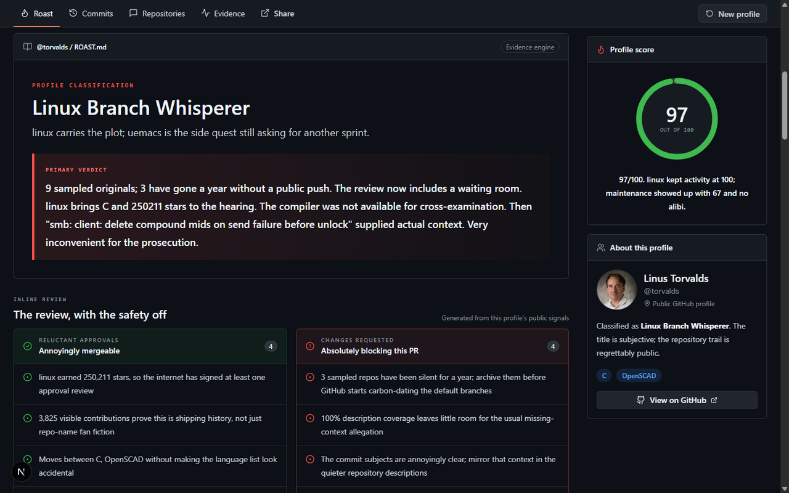

<p align="center">
  
</p>

<h1 align="center">GitRoast</h1>

<p align="center">A playful code review for public GitHub profiles.</p>

[](docs/ui-preview/before-share.png)

*Illustrative review of a public profile. Wording and scores depend on the available evidence.*

## Quick start

Requires Node.js 20.9+ and npm. API keys are optional.

```bash
npm ci
npm run dev
```

Open [localhost:3000](http://localhost:3000) and enter a public GitHub username, or try an example on the home screen. A completed review lets you inspect linked evidence, download a 1200 × 630 PNG card, or copy a link that reruns the review for the same username.

## What the review includes

- **Profile verdict:** a comic score and a breakdown of the public signals behind it.
- **Repository and commit reviews:** comments on selected repositories and recent public commit subjects.
- **Receipts and a next step:** links to the underlying work plus a suggested `roast.patch`.
- **Shareable output:** a review link and PNG card.

## Configuration

For optional settings, copy `.env.example` to `.env.local`:

| Variable | Purpose |
| --- | --- |
| `GITHUB_TOKEN` | Raises GitHub's public API limit; use a least-privilege token for public data. |
| `OPENAI_API_KEY` | Enables AI-assisted report text. Without it, the local roast engine runs. |
| `OPENAI_MODEL` | Selects the AI model (default: `gpt-6-sol`). |
| `ROAST_REPOSITORY_EVIDENCE` | Set to `off` to skip optional repository evidence requests (default: `on`). |
| `NEXT_PUBLIC_SITE_URL` | Sets the canonical URL for generated metadata in production. |

## How it works

GitRoast samples public GitHub repositories, descriptions, languages, contribution activity, and recent commit subjects. It selects notable repositories for review and may inspect bounded public README, package, release, tree, and commit evidence. Results can be cached for up to one hour. When an OpenAI key is configured, a bounded selection of these public signals is sent to the model.

Scores are comic heuristics about visible work, not measures of engineering skill. Missing or rate-limited evidence stays unknown; private work is excluded, and a file's presence does not prove its tests pass. Roasts address code habits and public artifacts, not personal traits.

## Deploy

Import the repository into Vercel as a Next.js project, set `NEXT_PUBLIC_SITE_URL` to your production host, and add any optional keys. `GET /api/health` provides a liveness check. A public deployment across multiple instances needs a distributed request limiter, durable cache, and global model-spend controls in place of the included process-local limiter.

## Contributing

Run the project checks before submitting changes:

```bash
npm run lint
npm test
npm run typecheck
npm run build
```

The Next.js app is in [`app/`](app), the report UI in [`components/`](components), and GitHub retrieval, scoring, and generation in [`lib/`](lib). See the [`product roadmap`](OVERHAUL.md) and [`roast-system research`](docs/roast-system-research-2026-09.md) for more context.
